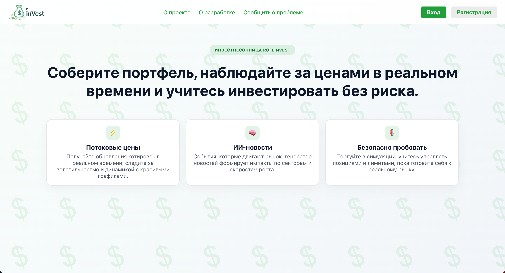
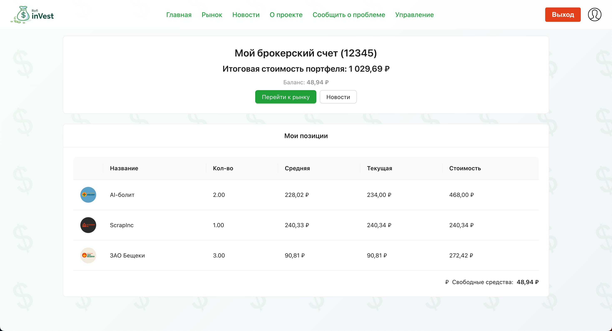
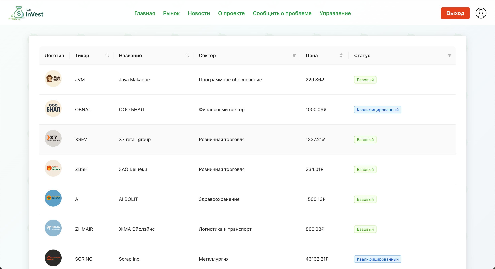
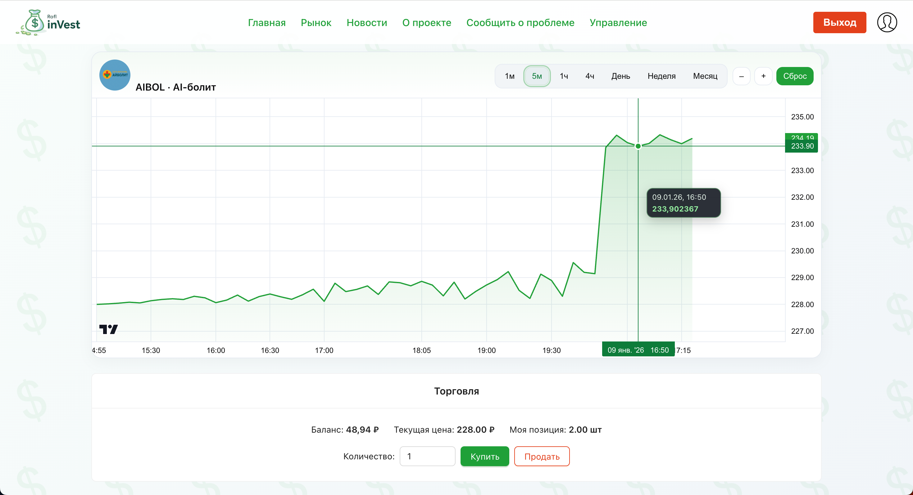
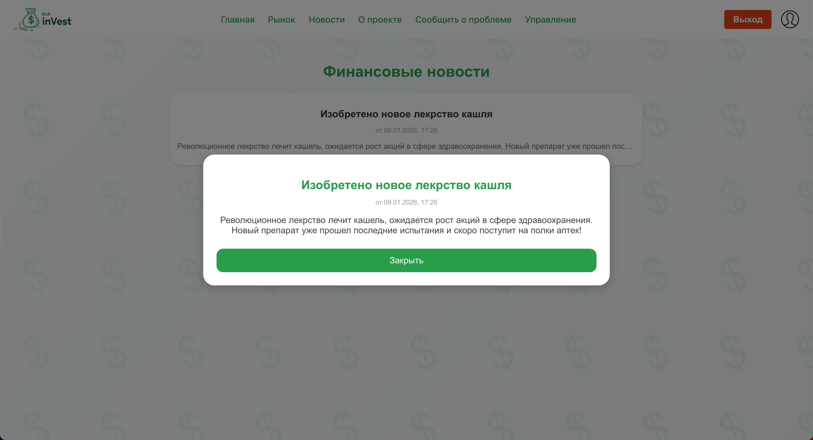
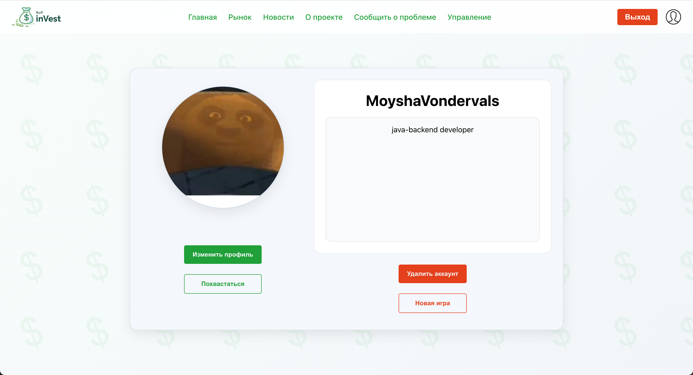

# ROFL Invest 🎮📈

**ROFL Invest** — интерактивная игра о мире инвестиций и финансовой стратегии. Игрок попадает в динамичную среду фондового рынка, где ему доступен выбор акций компаний из разных секторов экономики — от высоких технологий до энергетики и потребительских товаров.

Главная задача — **анализировать экономические и политические новости** и принимать взвешенные решения: какие активы купить, какие продать и как собрать портфель под выбранную стратегию. Это не просто симулятор «купи-продай»: важны риск-менеджмент и способность быстро адаптироваться к изменениям рынка.

В процессе игры игрок развивает свой профиль и открывает новые возможности:
- получить статус **квалифицированного инвестора**, который дает доступ к более сложным и волатильным инструментам;
- достичь уровня **суперквалифицированного инвестора**, чтобы участвовать в самых рискованных и потенциально прибыльных стратегиях;
- проходить внутриигровые испытания, следить за рынком и соревноваться с другими игроками.

---

## Технологии
- **Backend:** Spring Boot, Spring Data JPA, Spring Security  
- **DB:** PostgreSQL  
- **Messaging:** Apache Kafka (межсервисное общение)  
- **Frontend:** React, Redux  
- **Tools:** Docker, Git  

---

## Архитектура

Событийно-ориентированные микросервисы, общающиеся через Kafka.

```

              ┌──────────────────┐   ┌──────────────────┐
              │  account-service │   │  market-service  │
              │  auth, портфель, │   │  акции, цены,    │
              │  профиль         │   │  новости, WS     │
              └────────┬─────────┘   └──────────┬───────┘
                       │  Kafka: trade-executed │
                       └────────────────────────┘
                                 │
                          ┌──────┴──────┐
                          │  PostgreSQL │
                          └─────────────┘
```


---
## Скриншоты
- **WelcomePage:**

- **Главная:**

- **Рынок:**

- **Страница акции:**

- **Новости:**

- **Профиль пользователя:**

